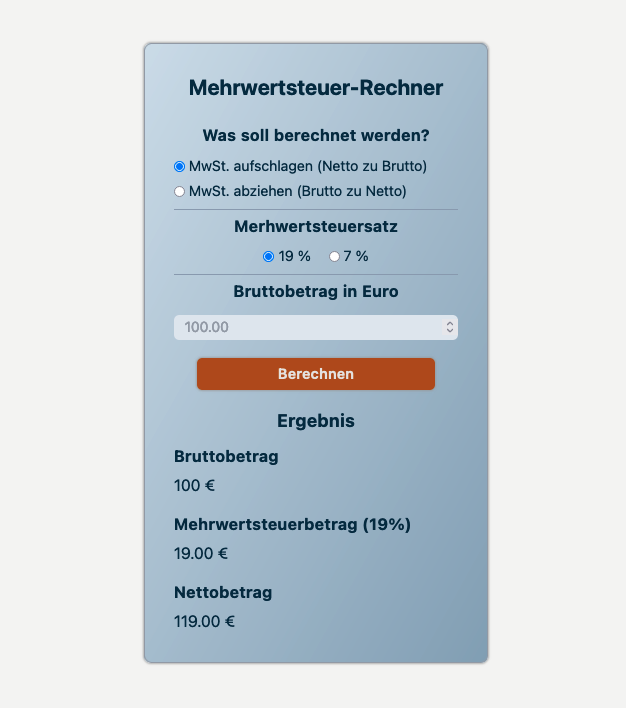

# Mehrwertsteuer-Rechner

This is a small project designed to calculate VAT (Valued Added Tax).
It offers the options to calculate in the brutto-to-netto or netto-to-brutto direction.
Additionally, you can choose either the 19% or 7% tax rate as the basis for your calculation.

## Functionality

This Project uses Vanilla JavaScript and DOM-Manipulation to implement its functionalities.

## Styling

Tailwind (utility-first CSS framework) was used for the styling.
